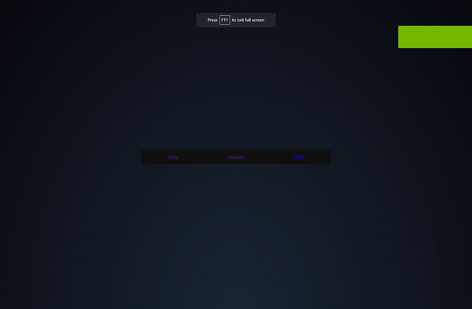

<p align="left">  </p>


<p align="center">
  
</p>


<p align="center">A HTML + CSS template for a website</p>

##

### Features

- RGB
- 3 Different pages (index, about , Github)


```
Just Install This Repo 
```

<p align="center">

</p>

<p align="center">

</p>

